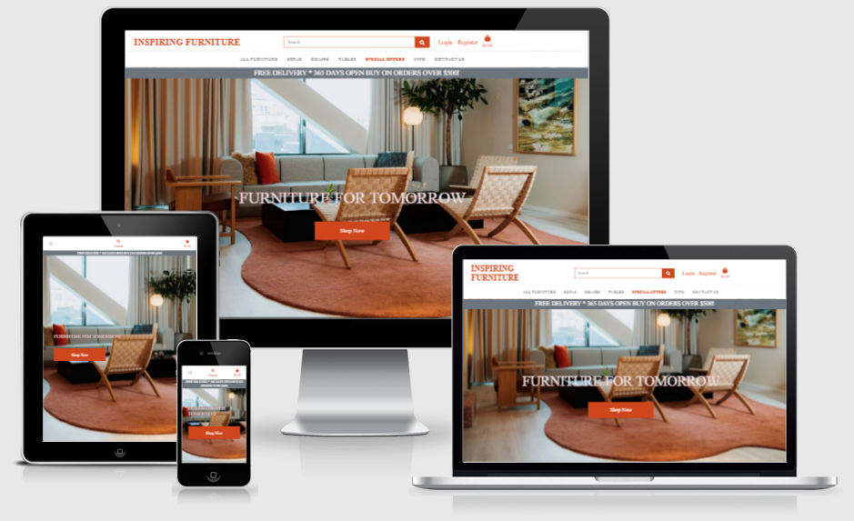
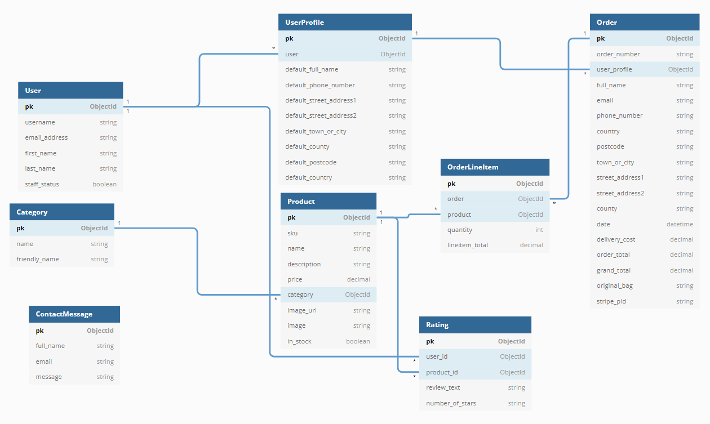

<h1 align="center">Inspiring Furniture</h1>

<span id="back_to_top"></span>



This project is the fourth Milestone Project in the "Full Stack Web Development Program" at [Code Institute](https://www.codeinstitute.net).

At Inspiring Furniture, we have the latest sofas, tables and chairs, with many different styles! A piece of furniture properly choosen can add atmosphere to a home. Furniture should be inspiring!

Inspiring Furniture offers different pieces of furniture in different designs. We offer inspiration in interiors and design, whether the furniture is for a small hallway, an office or an entire home. 


**View the live project [here](https://inspiring-furniture.herokuapp.com/).**

---

## Index 

- <a href="#ux">1. User experience (UX)</a>
    - <a href="#ux-goals">1.1. Project Goals</a>
    - <a href="#business-goals">1.2 Business Goals</a>
    - <a href="#visitor-goals">1.3 Visitor Goals</a>
    - <a href="#target-audience">1.4 Target Audience</a>
    - <a href="#ux-stories">1.5 User Stories</a>
    - <a href="#ux-design">1.6 Design</a>
    - <a href="#ux-mockup">1.7 Mockup designs</a>
- <a href="#information-architecture">2. Information Architecture</a>
    - <a href="#database">2.1 Database</a> 
    - <a href="#er-diagram">2.2 Entity-relationship Diagram </a>  
    - <a href="#data-modelling">2.3 Data Modelling</a>
- <a href="#features">3. Features</a>
    - <a href="#features-existing">3.1 Existing features</a>
    - <a href="#features-future">3.2 Features left to implement in the future</a>
- <a href="#technologies">4. Technologies used</a>
- <a href="#testing">5. Testing</a>
- <a href="#deployment">6. Deployment</a>
- <a href="#credits">7. Credits</a>
- <a href="#Acknowledge">8. Acknowledge</a>
- <a href="#Acknowledge">9. Disclaimer</a>

---

<span id="ux"></span>

<h1>1. User experience (UX)</h1>

<span id="ux-goals"></span>

### 1.1 Project goals 

- The site provides an authentication mechanism.
- Making a full-stack site that uses HTML, CSS, JavaScript, Python + Django.
- Creating a website that uses a relational database
- Creating a website that uses Stripe payments
- Creating a website that serves as a webshop to sell furniture with different designs.

<span id="business-goals"></span>

### 1.2 Business goals

- Create a secure and professional e-commerce website.
- Makes profit with selling furniture
- Promote funiture design, practicability and elegance
- Expand the business

<span id="visitor-goals"></span>

### 1.3 Visitor goals

- Get information about different furniture and materials
- Purchase the furniture on the website in a safe and secure way

<span id="target-audience"></span>

### 1.4 Target audience

- Everyone who needs furniture.
- People who want to be inspired by the design of furniture. 
- People who are looking for furniture to decorate their home, office, etc. 

<span id="ux-stories"></span>

### 1.5 User stories 

**First-time visitors/unregistered user goals:**

- As a visitor  I want to access the website from any device, to be able to use it anytime, anywhere.
- As a visitor, I want to navigate easily through the website, to be able to view all products.
- As a visitor, I want to contact the owners of the website,  to be able to easily ask a question.
- As a user, I want to find information about the company, to be able to identify adress, phone number, email.
- As a visitor, I want to navigate easily through the website, to be able to view a specific category of products(sofa, chair, bed)
- As a visitor, I want to navigate easily through the website, to be able to view details for a specific product.
- As a visitor, I want to navigate easily through the website, to be able to quickly identify deals, special offers.
- As a visitor, I want to easily find products rating, to be able to se customers experiences and opinions about the products.

**Registered/ authenticated user goals:**
- As a registered user, I want to create an account, to be able to log in and logout.
- As a registered user, I want to receive an email confirmation after registering in my new account, to be able to authenticat my self.
- As a registered user, I want to edit my profile, to be able to view my profile updated.
- As a registered user, I want to edit my profile, to be able toaccess my order history.
- As a registered user, I want to reset/change my password (if I forgot it), so I can get access to my profile.

**Consumer goals:** 

- As a consumer, I want to easily select the product that I wish, to be able to purchase it.
- As a consumer, I want to view my bag to be purchased, to be able to ajust the quantity of the product.
- As a consumer, I want to view my bag to be purchased, to be able to see the total price and shipping costs of my order.
- As a consumer, I want to easily enter my payment information, to be able to purchase a product.
- As a consumer, I want to pay with a card in a safe and secure way, to be able to know that my payment was successfull.
- As a consumer, I want to receive a confirmation email of the order, to be able know that the order is successfully received.

**Admin goals:** 

- As a user, I want to have convenient and secure admin interface avalable only for website admin, so that I can add, edit and remove products/services.
- As a user, I want to receive emails from the users when they fill out the contact form, so that I can reply on them satisfying users queries.
- As a website owner, I want to add, edit/update and delete products to be able to keep the site up to date with products portofolio.

<span id="ux-design"></span>

### 1.6 Design 

- #### Frameworks

[The Bootstrap front-end framework](https://getbootstrap.com/) is used throughout the project. Bootstrap provides a quick design, responsive grid system, extensive prebuilt components and a modern interface for the project.  

- #### Colour scheme 
The two primary colors that are used for the website are <span style="color:#cf461d">orange</span> and <span style="color:#212529">gray</span>. These colors are used because the colors give a warm and modern look. 


- #### Fonts
The **Sans serif** font is used throughout the whole website. The font is used in uppercase letters for all titles and lowercase letters are mainly used for paragraphs. 

- #### Icons
The icons in the project are provided by [Font Awesome](https://fontawesome.com/). All icons that are used have functional purposes such as the hamburger menu for the mobile version and social media icons.

- #### Images
The Home image is from [castellum.se](https://www.castellum.se/filtered/595124/rszww1604-80/kontorsguiden-4-683084708-rszww1604-80.jpg)
The images that are used for the project are from [NUS](https://cvml.comp.nus.edu.sg/furniture/download.html). 

<span id="ux-mockup"></span>

### 1.7 Mockup designs
[Balsamiq Wireframes tool](https://www.balsamiq.com/) was used to create all wireframes for the project.

Original wireframes for desktop and mobile can be found [here](https://github.com/emusat2021/Inspiring-Furniture/tree/main/wireframes)

<div align="right">
    <a href="#back_to_top">↥ Back to top!</a>
</div>

<span id="information-architecture"></span>

<h1>2. Information Architecture</h1>

<span id="database"></span>

### 2.1 Database
- During the development phase I have worked with the **sqlite3** database, which was set by default by Django. 
- For deployment, I used the **PostgreSQL** database which is provided by Heroku. 

<span id="er-diagram"></span>

### 2.2 Entity-relationship Diagram
I used [DBDiagram](https://dbdiagram.io/d) to create a diagram of the database.

The code to produce the diagram:
```
Table User {
    pk ObjectId [pk]
    username string
    email_address string
    first_name string
    last_name string
    staff_status boolean
}

Table UserProfile {
    pk ObjectId [pk]
    user ObjectId [ref: > User.pk]
    default_full_name string
    default_phone_number string
    default_street_address1 string
    default_street_address2 string
    default_town_or_city string
    default_county string
    default_postcode string
    default_country string
}

Table Order {
    pk ObjectId [pk]
    order_number string
    user_profile ObjectId [ref: > UserProfile.pk]
    full_name string
    email string
    phone_number string
    country string
    postcode string
    town_or_city string
    street_address1 string
    street_address2 string
    county string
    date datetime
    delivery_cost decimal
    order_total decimal
    grand_total decimal
    original_bag string
    stripe_pid string
}

Table OrderLineItem {
    pk ObjectId [pk]
    order ObjectId [ref: > Order.pk]
    product ObjectId [ref: > Product.pk]
    quantity int
    lineitem_total decimal
}

Table Category {
    pk ObjectId [pk]
    name string
    friendly_name string
}

Table Product {
    pk ObjectId [pk]
    sku string
    name string
    description string
    price decimal
    category ObjectId [ref: > Category.pk]
    image_url string
    image string
    in_stock boolean
}

Table Rating {
    pk ObjectId [pk]
    user_id ObjectId [ref: > User.pk]
    product_id ObjectId [ref: > Product.pk]
    review_text string
    number_of_stars string
}

Table ContactMessage {
    pk ObjectId [pk]
    full_name string
    email string
    message string
}
```
Entity-relationship diagram:



<span id="data-modelling"></span>

### 2.3 Data Modelling

#### 1. Profile app 
#### UserProfile model

| **Name** | **Database Key** | **Field Type** | **Validation** |
--- | --- | --- | --- 
 User | user | OneToOneField |  User, on_delete=models.CASCADE
 Full Name | default_full_name | CharField | max_length=50, null=True, blank=True
 Phone number | default_phone_number | CharField | max_length=20, null=True, blank=True
 Street address 1 | default_street_address1 | CharField | max_length=80, null=True, blank=True
 Street address 2 | default_street_address2 | CharField | max_length=80, null=True, blank=True
 Town/City | default_town_or_city | Charfield | max_length=40, null=True, blank=True
 County | default_county | CharField | blank_label='County', max_length=80, null=True, blank=True
 Postcode | default_postcode | CharField | max_length=20, null=True, blank=True
 Country | default_country | CountryField | blank_label='Country', null=True, blank=True
 
#### 2. Products app 
#### Category model

| **Name** | **Database Key** | **Field Type** | **Validation** |
--- | --- | --- | --- 
 name | name | CharField | max_length=254
 Friendly name | friendly_name | CharField | max_length=254, null=True, blank=True

 #### Product model

| **Name** | **Database Key** | **Field Type** | **Validation** |
--- | --- | --- | --- 
 Sku number | sku | CharField | max_length=254, null=True, blank=True
 Name| name | CharField | max_length=254
 Description| description | TextField | 
 Price | price | DecimalField | max_digits=6, decimal_places=2
 Category| category| ForeignKey | Category, null=True, blank=True, on_delete=models.SET_NULL
 Image url | image_url | URLField | max_length=1024, null=True, blank=True
 Image | image | ImageField | null=True, blank=True
 In stock | in_stock | BooleanField | default=True

#### Rating model

| **Name** | **Database Key** | **Field Type** | **Validation** |
--- | --- | --- | --- 
 User id | user_id | ForeignKey | settings.AUTH_USER_MODEL, on_delete=models.CASCADE
 Product id | product_id | ForeignKey | Product, null=True, blank=True, on_delete=models.SET_NULL
 Review text | review_text | TextField | 
 Number of stars | number_of_stars | IntegerField | null=False, blank=False

#### 3. Checkout app 
#### Order model

| **Name** | **Database Key** | **Field Type** | **Validation** |
--- | --- | --- | --- 
 Order number | order_number | CharField | max_length=32, null=False, editable=False
 User profile | user_profile | ForeignKey | UserProfile, on_delete=models.SET_NULL, null=True, blank=True, related_name='orders'
 Full name | full_name | CharField | max_length=50, null=False, blank=False
 Email| email| EmailField | max_length=254, null=False, blank=False
 Phone number | phone_number | Charfield | max_length=20, null=False, blank=False
 Country| country | CountryField | blank_label='Country *', null=False, blank=False
 Postcode | postcode| CharField | max_length=20, null=True, blank=True
 Town/City | town_or_city | CharField | max_length=40, null=False, blank=False
 Street address 1 | street_address1 | CharField | max_length=80, null=False, blank=False
 Street address 2 | street_address2 | CharField | max_length=80, null=True, blank=True
 County | county | CharField | max_length=80, null=True, blank=True
 Date | date | DateTimeField | auto_now_add=True
 Delivery cost | delivery_cost | DecimalField | max_digits=6, decimal_places=2, null=False, default=0
 Order total | order_total | DecimalField | max_digits=10, decimal_places=2, null=False, default=0
 Grand total | frand_total | DecimalField | max_digits=10, decimal_places=2, null=False, default=0
 Original bag | original_bag | TextField | null=False, blank=False, default=''
 Stripe pid | stripe_pid | CharField | max_length=254, null=False, blank=False, default=''

 #### OrderLineItem model

| **Name** | **Database Key** | **Field Type** | **Validation** |
--- | --- | --- | --- 
 Order  | order | ForeignKey | Order, null=False, blank=False, on_delete=models.CASCADE, related_name='lineitems'
 Product | product | ForeignKey | Product, null=False, blank=False, on_delete=models.CASCADE
 Quantity | quantity | IntegerField | null=False, blank=False
 Lineitem total | lineitem_total | DecimalField | max_digits=6, decimal_places=2, null=False, blank=False, editable=False

#### 4. Contact app 
#### ContactMessage model

| **Name** | **Database Key** | **Field Type** | **Validation** |
--- | --- | --- | --- 
 Full name | full_name | CharField | max_length=60
 Email| email| EmailField | 
 Message | message| TextField | 

<div align="right">
    <a href="#back_to_top">↥ Back to top!</a>
</div>

<span id="features"></span>

<h1>3. Features</h1>

<span id="features-existing"></span>

### 3.1 Existing features 

The website is classified by seven applications: home, products, contact, bag, checkout, profiles and info.

#### 1. Navbar
- **The name 'Inspiring Furniture'** (which also serves as logo) is clearly visible on the left side of the navbar. The name is also a redirect to the home page. 
- The navbar contains the **search functionality**, where the user can search for products. The search term would match with the product name or the product description. 
    - The search functionality allows users to enter keywords associated with the name or the description of the product. 
    - The search results are displayed on the products page. 
    - On the product page, a message will appear with '0 Products found' if there are no search results.
- The navbar contains the **Login** and **Register** links, where people can login or register.
- After the user is authenticated, the navbar contains **My Account** and **Logout** links. **My Account** contains My Profile, Change password, Order History and My Reviews.
- The navbar contains the **shopping bag**, where users can see the items they have put in the order. The basket redirects to the order summary. 
- The navbar is visible as a **hamburger menu** on mobile devices. 


#### 2. Home page 
- The home page serves as an introduction to the webshop and contains a "Shop Now" button.

#### 3. Product page 
- The product page contains all items the shop has to offer
- All **categories** are displayed under the navigation bar on the top of the page, so that users can easily navigate through the categories.
- The items can be **sorted** by name A-Z, Z-A, price from high to low, price from low to high, category from A-Z, Z-A.
- There is a **back to top button**, where people can click on the link to go back to the top of the page. 
- Each product has an average of ratings expressed as a number between 0 and 5

#### 4. Product detail page 
- **The product detail page shows information about that specific item**, the information includes; name, image, category, if the item is in stock, the price and the product description. 
- A user can **choose the quantity** of the product. The product quantity can be between 1 and 20 items. 
- There is a button where the user can **add the item to the shopping bag**.
    - When the user puts the item in the bag there will be a toast success message.
    - When the user puts the item in the bag, the shopping bag in the navbar will show the total amount of the products that are in the shopping bag.

#### 5. The shopping page
- **The shopping bag page is available for logged in users and guests.** Purchases can be made by both of them.
- Gives **an overview of all items** that are in the shopping bag, the overview information includes; image, name, SKU, quantity, price and subtotal.
- users  can **update the quantity** of the items they have.
- users  can **delete items** from their order.
- There is an **overview of the total price, the delivery costs and the grant total** of the order.
- There is a button with **‘Keep shopping’** that links to the product page. 
- There is a button with **‘Secure checkout’** to continue the purchase.

#### 6. Checkout page 
- The **order summary** gives information about the item, this information includes; name, price, total, delivery costs and grant total. 
- **The checkout form** to continue the payment. The form asks for the following information: full name, email, phone number, country, county, postal code, town or city and  street address 1 - all these input fields must be valid. The country field is an input where users can scroll to a list to choose the country.
- At the end of the checkout form there is an option to **save** the delivery information to the user's profile. This function is only shown when the user is authenticated.
- The user has to fill in their information about the card number. The Stripe functionality is in testing mode, the credit card number **4242 4242 4242 4242** will lead to a successful payment. Expiration date, CVC and ZIP can be made up yourself.
- A **webhook** is used for security when the order is processed, even in the case when the payment process is interrupted.
- There is a **button to go back to the shopping bag page.** The user can go back to the shopping bag page to adjust items in the bag.
- There is a button to **complete the order**.
- When the user clicks on the complete the order button, there is a little **loading overlay**. The user is redirected to the checkout success page after the overlay. 
- **When the order is completed:**
    - There is a redirect to the checkout success page.
    - A confirmation email is sent to the user’s mail.
    - A toast message ‘completed’ shows to ensure the user that the order is successfully completed.

#### 7. Checkout succes page
- Contains a **thank you message**.
- Includes information about the **order summary**. The order summary consists of information about the date, order number, products, delivery information and billing information. 
- There is a button to go back to the product page.

#### 8. The info page 

- **How to buy** contains the following pieces of information
  - An user can buy products both as an unregistered user and as a registered user.
  - An user can only rate a product after the user has purchased it as an Registered/Authenticated user.

#### 9. The profile page 
- This page is available to authenticated users only
- There is a **Default Delivery Information** (country, postal code, town/city, county, street address 1 and street address 2. Users can **edit this information** also. 

#### 10. The Change password page
- This page is available to authenticated users only
- The user can change the password

#### 10. The order history page 
- This page is available to authenticated users only
- There is an **order history** page (order number, date of order, items, quantity and total) 

#### 11. My reviews page 
- This page is available to authenticated users only
- This page contains all the products that a user has purchased 
- The user has the possibility to rate a product by clicking on a star from 1 to 5, change the rating (by clearing it) or clear the rating

#### 12. Contact page 
- Users can reach out to the company with the **contact form**. The user has to fill in the name, email and message. The form will be sent to the admin. 
- If the user is already logged in, the name and email are automatically populated based on the information in the user's profile

#### 13. Django-Allauth features 
- **Sign up**
    - Users can create a new account by filling in a form where the user have to fill in an email, username, password and password confirmation. If the info already exists, there will be a message that he/she already has an account. The user can submit the form when the data is new. A verification email is sent to the user.
- **Login**
    - Users can login with their username and password.
    - A user can reset its own password.
- **Logout** 
    - The user can logout by clicking the logout link. After clicking the link there will be a confirmation if the user is sure to logout. 

#### 14. Error pages 
- There are custom error handling pages with short information about the error. The errors are displayed in the style of the website. 
- The following errors are included: 404 and 500.

<span id="features-future"></span>

### 3.2 Features left to implement in the future 
- Adding a favorite section. Users can add their favorite products and see them on their favorite page if they are logged in. 
- Logging in with social media account, such as Facebook and Google.
- Greating a loyalty programme, where users can save points for discounts.
Product details:
- People can only buy a product if the product is in stock. If the product isn't in stock, the content on the product detail page will say that the product is sold out and the page is referring to the contact page. 
- Add a button to **login with an account** on the checkout page, where the personal and delivery information already exists to continue the payment process quickly. 
- add a feature on the profile page so that the user can edit their email.
- add service delivery information in the Info page
- 'how to buy' content can be moved in the admin interface as a data model

<div align="right">
    <a href="#back_to_top">↥ Back to top!</a>
</div>

<span id="technologies"></span>

<h1>4. Technologies used</h1>

#### Languages used
- [HTML5](https://en.wikipedia.org/wiki/HTML5)
    - HTML5 provides the structure and the content for my project. 
- [CSS3](https://en.wikipedia.org/wiki/Cascading_Style_Sheets)
    - CSS3 provides the style of the HTML5 elements.
- [JavaScript](https://nl.wikipedia.org/wiki/JavaScript)
    - JavaScript provides the interactive elements on the website. 
- [jQuery](https://jquery.com/)
    - jQuery is used for implementation of Bootstrap.
- [Python](https://www.python.org/)
    - Python provides the backend of the project.
- [Jinja](https://en.wikipedia.org/wiki/Jinja_(template_engine))
    - Jinja provides the templating language for Python.

#### Frameworks, libraries & other
- [Django](https://www.djangoproject.com/) 
    - The GitPod is used as Python framework for the project.
- [Gitpod](https://www.gitpod.io/) 
    - The GitPod is used to develop the project.
- [Git](https://git-scm.com/)
    - The Git was used for version control to commit to Git and push to GitHub.
- [GitHub](https://github.com/)
    - The GitHub is used to host the project.
- [Pip3](https://pip.pypa.io/en/stable/)
    - Pip3 is used for installing the necessary tools, libraries and frameworks.
- [Heroku](https://heroku.com/)
    - Heroku is used to host the project.
- [AWS Amazon](https://aws.amazon.com/)
    - AWS Amazon is used to store static and media files.
- [Boto3](https://boto3.amazonaws.com/v1/documentation/api/latest/index.html)
    - Boto3 is used for compatibility in AWS.
- [Gunicorn](https://pypi.org/project/gunicorn/)
    - Gunicorn is used to enable deployment to Heroku.
- [Spycopg2](https://pypi.org/project/gunicorn/)
    - Spycopg2 is used to enable the PostGreSQL database to connect with Django.
- [Google Fonts](https://fonts.google.com/)
    - Google Fonts is used to provide the font roboto for all the text that is used in the project. 
- [Balsamiq](https://www.balsamiq.com/)
    - Balsamiq is used to create the mockup designs for the project.
- [Bootstrap](https://getbootstrap.com/)
    - Bootstrap is used for the design framework.
- [Heroku](https://dashboard.heroku.com/)
    - Heroku is the cloud platform to deploy the app.
- [Django Crispy Forms ](https://django-crispy-forms.readthedocs.io/en/latest/)
    - Django Crispy Forms is used to style the Django forms
- [Stripe](https://stripe.com/en-nl)
    - Stripe is used for the secure payments 

#### Databases 
- [SQlite3](https://www.sqlite.org/index.html)
    - SQlite3 is used as the development database.
- [PostgreSQL](https://www.postgresql.org/)
    - PostgreSQL is used as the production database.

#### Testing tools used 
- [Chrome DevTools](https://developers.google.com/web/tools/chrome-devtools/open) is used to detect problems and test responsiveness.
- [W3C Markup Validation Service](https://validator.w3.org/)
    - The W3C Markup Validation Service is used to check whether there were any errors in the HTML5 code. 
- [W3C CSS validator](https://jigsaw.w3.org/css-validator/)
    - The W3C CSS validator is used to check whether there were any errors in the CSS3 code.
- [JShint](https://jshint.com/)
    - JShint is a JavaScript validator that is used to check whether there were any errors in the JavaScript code. 
- [PEP8](http://pep8online.com/)
    - The PEP8 validator is used to check whether there were any errors in the Python code.

<div align="right">
    <a href="#back_to_top">↥ Back to top!</a>
</div>

<span id="testing"></span>

<h1>5. Testing</h1>

The testing process can be found [here](TESTING.md).

<div align="right">
    <a href="#back_to_top">↥ Back to top!</a>
</div>

<span id="deployment"></span>

<h1>6. Deployment</h1>

#### Requirements 
- Python3 
- Github account 
- Heroku account
- An IDE of choice 
- Stripe account
- AWS Amazon account
- Gmail account

#### Clone the project 
To make a local clone, follow the following steps. 
1. Log in to GitHub and go to the repository. 
2. Click on the green button with the text **“Code”.**
3. Click on **“Open with GitHub Desktop”** and follow the prompts in the GitHub Desktop Application or follow the instructions from **[this link](https://docs.github.com/en/free-pro-team@latest/github/creating-cloning-and-archiving-repositories/cloning-a-repository#cloning-a-repository-to-github-desktop)** to see how to clone the repository in other ways. 

#### Working with the local copy
1. Install all the requirements: Go to the workspace of your local copy. In the terminal window of your IDE type: **pip3 install -r requirements.txt**.
2. Set up the environment variables: 
    - Create a `.gitignore` file in the root directory of the project. 
    - Create a `.env` file. This will contain the following environment variables:

    ```
    import os
    os.environ("SECRET_KEY", "Added by developer")
    os.environ("STRIPE_PUBLIC_KEY", "Added by developer")
    os.environ("STRIPE_SECRET_KEY", "Added by developer")
    os.environ("STRIPE_WH_SECRET", "Added by developer")
    ```
    - Add the `.env` file to the `.gitignore` file.
    **NOTE:** See more in the [Stripe Documentation](https://stripe.com/docs/keys) to read more about setting the API key.
3. Migrate the models to create the database by the following commands:
    - `python3 manage.py makemigrations`
    - `python3 manage.py migrate`
4. Load the data fixtures exactly in this order. Before adding ratings fixture you need to have 10 registered users with user_id 4 to 13 in the database.
    - `python3 manage.py loaddata categories`
    - `python3 manage.py loaddata products`
    - `python3 manage.py loaddata ratings`
5. Create a superuser. The superuser has acces to the admin environment.
    - `python3 manage.py createsuperuser`
    - Enter your username, email and password.
6. Run the app: Open your terminal window in your IDE. Type: `python3 manage.py runserver` and run the app.
7. To acces the admin environment, you can add `/admin` at the end of your url and login with the superuser.


#### Heroku Deployment  
1. Set up local workspace for Heroku 
    - In terminal window of your IDE type: `pip3 freeze -- local > requirements.txt.` (The file is needed for Heroku to know which files to install.)
    - Create a Procfile with the following text: `web: gunicorn <name app>.wsgi:application` (The file is needed for Heroku to know which file is needed as an entry point.)
    - Push all these files to your GitHub reposity.
2. Set up Heroku
    - Create a Heroku account and create a new app and select your region. 
    - Go to resources in Heroku and search for **postgess**. Select **Hobby dev - Free** and click on the provision button to add it to the project.
    - Go to the settings app in Heroku and go to **Config Vars**. Click on **Reveal Config Vars** and add the following config variables:

    | KEY            | VALUE         |
    |----------------|---------------|
    | AWS_ACCESS_KEY_ID | `<aws access key>`  |
    | AWS_SECRET_ACCESS_KEY | `<aws secret access key>`  |
    | DATABASE_URL| `<postgres database url>`  |
    | DEFAULT_FROM_EMAIL | `<default from email>` |
    | EMAIL_HOST_PASS | `<email password(generated by Gmail)>` |
    | EMAIL_HOST_USER| `<email address>`  |
    | SECRET_KEY | `<your secret key>`  |
    | STRIPE_PUBLIC_KEY| `<your stripe public key>`  |
    | STRIPE_SECRET_KEY| `<your stripe secret key>`  |
    | STRIPE_WH_SECRET| `<your stripe wh key>`  |
    | USE_AWS | `True`  |

3. Set up Database
    - Copy the **DATABASE_URL** (Postgres URL) from the config variables of Heroku and past it into the default database in `setting.py`

    ```
    DATABASES = {
        'default': dj_database_url.parse("<DATABASE_URL here>")
    }
    ```
    **NOTE:** This setup for the databases is temporary for deployment to Heroku.
    - Migrate the models to create the database by the following commands:
        - `python3 manage.py makemigrations`
        - `python3 manage.py migrate`
    - Load the data fixtures for categories and product exactly in this order. Before adding ratings fixture you need to have 10 registered users with user_id 4 to 13 in the database.
        - `python3 manage.py loaddata categories`
        - `python3 manage.py loaddata products`
        - `python3 manage.py loaddata ratings`
    - Create a superuser. The superuser has acces to the admin environment.
        - `python3 manage.py createsuperuser`
        - Enter your username, email and password.
    - Now you can remove the DATABASE_URL from `settings.py` and set the 'old' default DATABSE settings.
    - Adjust the ALLOWED_HOSTS in you settings.py with the following:
    
    ```
    ALLOWED_HOSTS = ['<your Heroku app URL>', 'localhost]
    ```
    - Push the code to Github.
4. Connect with Heroku 
    - Click on the **Connect to GitHub** section in the deploy tab in Heroku. 
        - Search your repository to connect with it.
        - When your repository appears click on **connect** to connect your repository with the Heroku. 
    - Set automatic deploment: Go to the deploy tab in Heroku and scroll down to **Aotmatic deployments**. Click on **Enable Automatic Deploys**. By **Manual deploy** click on **Deploy Branch**.
Heroku will receive the code from Github and host the app using the required packages. 
Click on **Open app** in the right corner of your Heroku account. The app wil open and the live link is available from the address bar. 

#### Hosting static and media files with AWS
The static and media files are hosted in the AWS S3 Bucket. To host them you will need an account and create an S3 bucket and set a group, policy and user in the IAM environment. 
Read more about the the S3 Bucket storage [here](https://aws.amazon.com/s3/). For more information about the storage in your project [click here](https://django-storages.readthedocs.io/en/latest/backends/amazon-S3.html).

<div align="right">
    <a href="#back_to_top">↥ Back to top!</a>
</div>

<span id="credits"></span>

<h1>7. Credits</h1>

#### Media 
- The Home image is from [castellum.se](https://www.castellum.se/filtered/595124/rszww1604-80/kontorsguiden-4-683084708-rszww1604-80.jpg)
- The images that are used for the project are from [NUS](https://cvml.comp.nus.edu.sg/furniture/download.html). 

#### Code
- The code for the project is partly from the video lessons of the Boutique Ado project of [Code Institute](https://codeinstitute.net/). 
- [Stack Overflow](https://stackoverflow.com/) was helpful for little bugs or troubles in the code. 
- Parts of the code were taken from the following pages:
  - https://github.com/juanstelling/MS4-prints
  - https://github.com/irinatu17/Art-of-Tea
- Validate forms ideas taken from:
  - https://stackoverflow.com/a/15472787
  - https://stackoverflow.com/a/47600422
  - https://stackoverflow.com/a/30302125
- Convert decimal to 1 digit after the decimal point:
  - https://stackoverflow.com/a/455634
- Border letters:
  - https://stackoverflow.com/questions/2570972/css-font-border
- Code for ratings with stars:
  - https://ishadeed.com/article/star-rating-svg/
  - https://daily-dev-tips.com/posts/css-svg-star-rating/
- Generate random names to products:
  - https://www.randomlists.com/random-names?qty=200


<div align="right">
    <a href="#back_to_top">↥ Back to top!</a>
</div>

<span id="Acknowledge"></span>

<h1>8. Acknowledge</h1>

- I received support for this project from my mentor <a href="https://www.codeinstitute.net/" target="_blank">[Precious Ijege](https://www.linkedin.com/in/precious-ijege-908a00168/?originalSubdomain=ng) at [Code Institute](https://codeinstitute.net)</a>.
- My husband Bogdan Musat and son David Musat for their immense support, patience and love!
- All friends and family that took the time to test this for me.
- Bogdan Musat helped me with generating the fixtures

<div align="right">
    <a href="#back_to_top">↥ Back to top!</a>
</div> 
<span id="Disclaimer"></span>

<h1>9. Disclaimer</h1>
This project is for educational use only.

<div align="right">
    <a href="#back_to_top">↥ Back to top!</a>
</div>